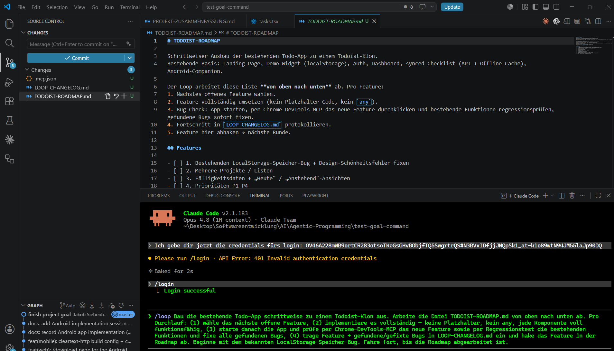
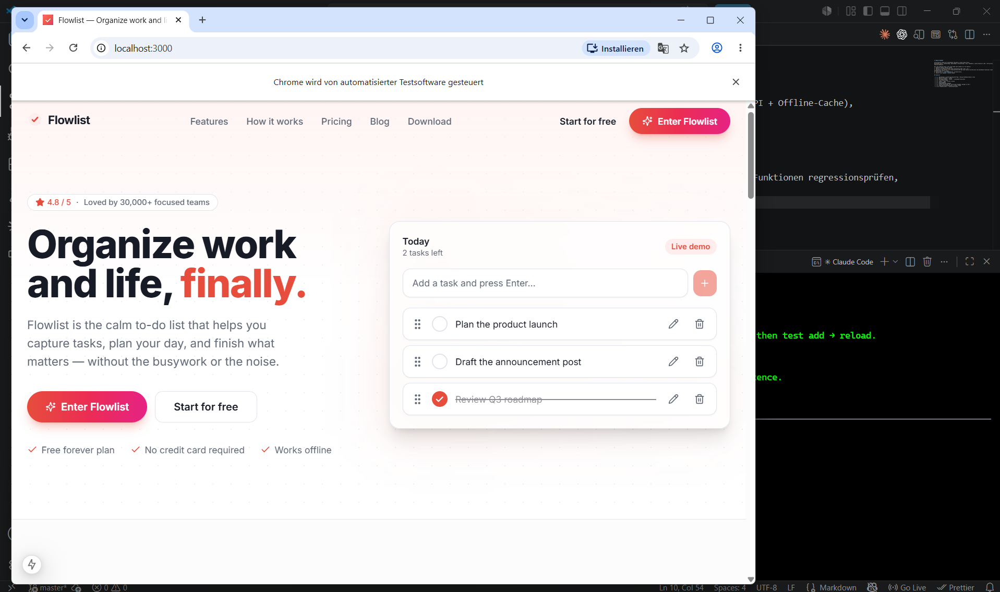
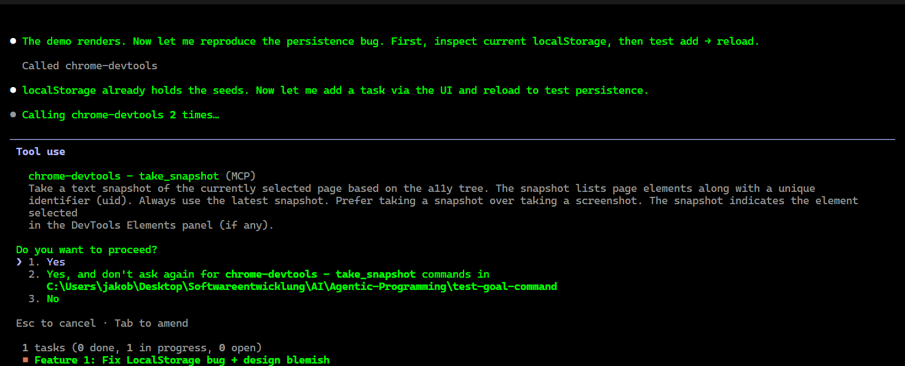

# Projekt Loop

## Beschreibung
### Die Todo-Webapp aus dem /goal-Projekt mit dem Befehl "/loop" iterativ Richtung Todoist ausbauen

Dieses Projekt ist die direkte Fortsetzung des [/goal-Projekts](./claude-code-goal-command.md).
Dort wurde die Todo-Webapp per Brute-Force gebaut — schnell fertig, aber ungetestet und mit ein
paar Restbugs. Genau dort setzt der /loop Befehl an: statt eines einzigen großen autonomen Pushs
arbeitet er in wiederholten, getakteten Zyklen. Mein Plan: die App Runde für Runde Richtung Todoist
ausbauen und nach jedem neuen Feature einen Bug-Check machen.

## Was ist der /loop Modus und was macht er ?

Der /loop Befehl führt einen Prompt (oder Slash-Befehl) wiederholt aus. Es gibt zwei Spielarten:

- **Mit Intervall** (`/loop 5m ...`): der Prompt wird in einem festen Zeitabstand erneut ausgeführt —
  praktisch zum Pollen von Status (Builds, Deployments, Healthchecks).
- **Ohne Intervall** (self-paced): Claude taktet sich selbst und wiederholt den Zyklus so lange, bis
  die Aufgabe erledigt ist.

Für dieses Projekt nutze ich die **self-paced** Variante: Claude arbeitet eine Feature-Roadmap ab und
verifiziert nach jedem Schritt.

## Der Plan: Roadmap + Loop-Prompt

Ich lege im Todo-App-Repo eine `TODOIST-ROADMAP.md` an, die die nächsten Features nach Priorität
auflistet (knüpft an das Bestehende an — Landing, Demo-Widget, Auth und Dashboard sind schon da):

1. Bestehenden LocalStorage-Speicher-Bug + Design-Schönheitsfehler aus dem Goal-Projekt fixen
2. Mehrere Projekte/Listen
3. Fälligkeitsdaten + „Heute" / „Anstehend"-Ansichten
4. Prioritäten P1–P4
5. Labels/Tags + Filter & Suche
6. Unteraufgaben
7. Wiederkehrende Aufgaben
8. Schnell-Hinzufügen mit natürlicher Eingabe („morgen 17 Uhr")
9. Drag-and-drop-Reihenfolge in echten Listen
10. Produktivitäts-/Karma-Statistiken

Eine Iteration des Loops sieht so aus:

1. Nächstes offenes Feature aus der Roadmap wählen.
2. Feature vollständig umsetzen (kein Platzhalter-Code, kein `any`).
3. Bug-Check: App starten, per Chrome-DevTools-MCP das neue Feature durchklicken **und** bestehende
   Funktionen regressionsprüfen, gefundene Bugs sofort fixen.
4. Fortschritt in `LOOP-CHANGELOG.md` protokollieren.
5. Feature in der Roadmap abhaken → nächste Runde.

Der Prompt, den ich verwendet habe:

> /loop Bau die bestehende Todo-App schrittweise zu einem Todoist-Klon aus. Arbeite die Datei
> `TODOIST-ROADMAP.md` von oben nach unten ab. Pro Durchlauf: (1) wähle das nächste offene Feature,
> (2) implementiere es vollständig — keine Platzhalter, kein `any`, jede Komponente voll funktionsfähig,
> (3) starte danach die App und prüfe per Chrome-DevTools-MCP das neue Feature sowie per Regressionstest
> die bestehenden Funktionen und fixe alle gefundenen Bugs, (4) trage Feature + gefundene/gefixte Bugs
> in `LOOP-CHANGELOG.md` ein und hake das Feature in der Roadmap ab. Beginne mit dem bekannten
> LocalStorage-Speicher-Bug. Fahre fort, bis die Roadmap abgearbeitet ist.

***

> **So ganz nebenbei. 🏷️ Hier habe ich Claude Code gesagt, er soll selbst die .md files schreiben und nur alles in den CHat gepastet, was man in diesem Artikel sieht**

## Logbuch — Iteration für Iteration

<!-- Wird beim Experimentieren befüllt: pro Runde Feature, gefundene Bugs und Fixes. -->

> In der Zwischenzeit, nachdem ich Claudius Zugriff auf das MCP Tool Chrome Dev Tools gegeben habe (mit headless Modus).
hat er gleich den Browser gestartet.

Fragen stellt er trotzdem noch, deswegen bin ich auf yes and dont ask again gegangen, weil mit der Zeit wird das nervig.

## Bewertung & Vergleich /goal vs. /loop

<!-- Fazit nach dem Experiment: Wo spielt /loop seine Stärke aus, wo nicht?
     /goal = ein großer Push auf ein festes Ziel; /loop = inkrementelle Lieferung mit QA-Gate. -->
