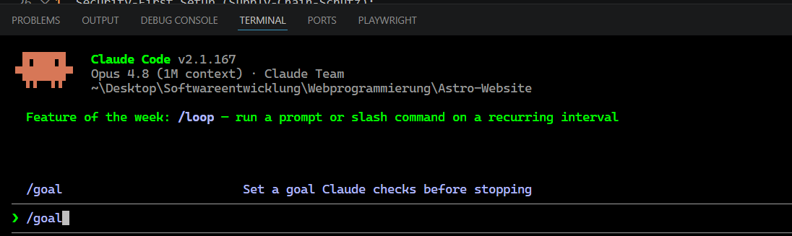

# Projekt Goal

## Beschreibung
### Todo Webapp bauen mit Claude Code und den Befehl "/goal" testen

## Was ist der Goal Modus und was macht er ?

Ich habe mir vorgenommen, erst mal nur vibe zu coden um zu sehen, wie gut das funktioniert und wie schnell ich damit sein werde

Mein erster Prompt, welches ich mir von Gemini habe optimieren lassen für den goal Modus:

/goal Erstelle eine moderne, inhaltsstarke Homepage (Landingpage) im Stil von Todoist unter Verwendung von Next.js (App Router), TypeScript und Tailwind CSS.

Befolge dabei strikt folgende Sicherheits-, Architektur- und Qualitäts-Vorgaben:

1. Security-First Setup (Supply-Chain-Schutz): 
   - Nutze pnpm statt npm als Paketmanager.
   - Erstelle als allererstes eine `.npmrc` im Projektordner mit:
     ignore-scripts=true
     min-release-age=10080
   - Erzwinge die Nutzung der Lockfile (pnpm-lock.yaml).

2. Projekt-Initialisierung & Zero-Placeholder-Regel:
   - Initialisiere ein sauberes Next.js-Projekt mit App Router und TypeScript über pnpm (Nutze stabile Versionen).
   - Entferne sämtlichen Demo-Code vollständig.
   - REGEL: Schreibe keinen Platzhalter-Code, keine auskommentierten Funktionen und keine unvollständigen Typen (kein 'any'). Jede Komponente muss voll funktionsfähig sein.

3. Architektur, Layout & Komponenten-Struktur:
   - Erstelle eine responsive, fixierte SaaS-Navigationsleiste (oben) und ein minimalistisches Landingpage-Layout im Todoist-Stil.
   - Nutze für UI-Komponenten (Buttons, Inputs, Dropdowns) die "Shadcn UI"-Philosophie (primitive Radix-Komponenten gestylt mit Tailwind), um maximale Zugänglichkeit (ARIA) zu garantieren.
   - Richte dynamische Routen für Blog-Artikel unter `app/blog/[slug]` und Kategorien unter `app/category/[slug]` ein.

4. Content-Infrastruktur & Interaktives Widget:
   - Verwende lokale MDX-Dateien oder typisierte JSON-Strukturen für die Blog-Artikel, optimiert für schnelles statisches Rendern.
   - Integriere ein interaktives Demo-Checklisten-Widget auf der Startseite: Nutzer müssen Aufgaben hinzufügen, per Drag-and-Drop verschieben und mit einer flüssigen visuellen Animation (z. B. Durchstreichen und Verblassen) als erledigt markieren können (nutze hierfür Framer Motion). Speichere den Zustand im LocalStorage, damit er beim Neuladen bleibt.

5. Core Web Vitals & SEO-Exzellenz:
   - Optimiere die Seite auf einen Lighthouse-Score von >95 in allen Kategorien.
   - Nutze die Next.js Metadata-API für vollständige Open-Graph/Twitter-Tags, Robots.txt, Sitemap.xml und dynamisch generierte strukturierte JSON-LD Daten für Blogartikel (Schema.org `Article` & `WebSite`).
   - Verwende strikt `next/image` für alle Bilder mit korrekten Aspect-Ratios und `next/font` für die Schriftarten (lokal geladen, kein Google-CDN-Call wegen DSGVO).

Bitte erstelle zuerst einen strukturierten Meilenstein-Plan, der zeigt, wie du die Sicherheitsvorkehrungen zuerst triffst, und arbeite ihn dann autonom ab.

Nachdem Claude Code mit dem programmieren fertig wurde (Dauer ~20 min.) hat er mir eine schöne erste Website, ähnlich wie Todoist gebaut, was noch fehlt ist noch eine Möglichkeit sich einzuloggen.

## Next step - Login/Signup einbauen (Dauer ~15 min.)

**Login-Goal + Zusatzwünsche:** „Loginsystem einbauen" → (nach Rückfragen) eigenes jose-basiertes Auth mit
   SQLite und geschütztem `/dashboard`. Ergänzt: „ein spezieller fantasievoller Button, der zur Login-Seite
   weiterleitet; ein Logo erstellen; beim Klick ein Backdrop mit Logo + Spinner, bis die Login-Seite geladen ist."

## Next step PWA bauen lassen, wird aber nicht verwendet - obsolet (Dauer ~10 min.)

**PWA-/Sync-Goal:** „Erstelle alles Besprochene — installierbare PWA (Android + Desktop) + geräteübergreifende
   Sync — beurteile selbst was sinnvoll ist, und schreibe am Ende eine Zusammenfassung in ein `.md`."

### Meine Bewertung des Zwischenstandes der Todo Webapp
- in Bearbeitung **...**

## Next step Android App bauen lassen, welche sich mit der Webapp synchronisiert 
- in Bearbeitung **...**